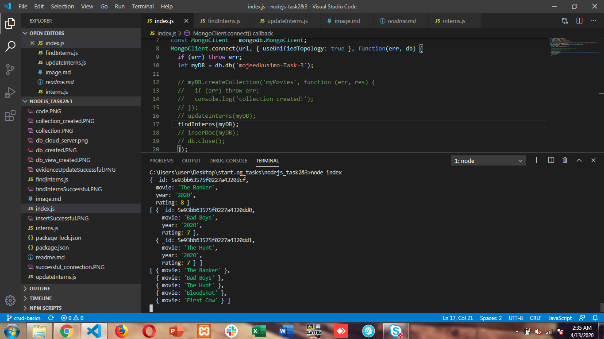

# StartNG Nodejs Task 3

## This is the result from the function in interns.js file showing the new collection created with the 5 documents inserted.

#### 

## This is the result from the function in findInterns.js file showing the following queries:

### (a)The first document in the collection
### (b)All movies with a rating of 7 and 
### (c)A projection object returning only movie titles and nothing else.

#### 

## This is the result from the function in updateInterns.js file showing the result of the updated collection:

#### #### 
