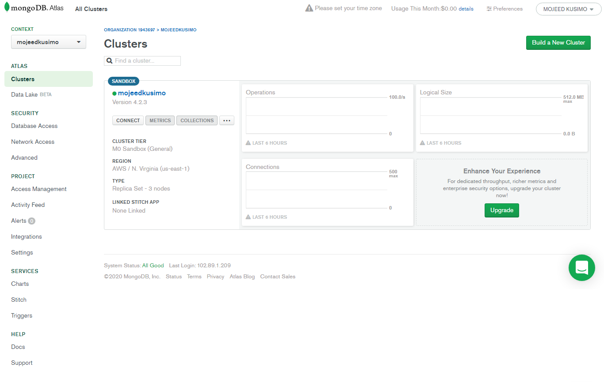
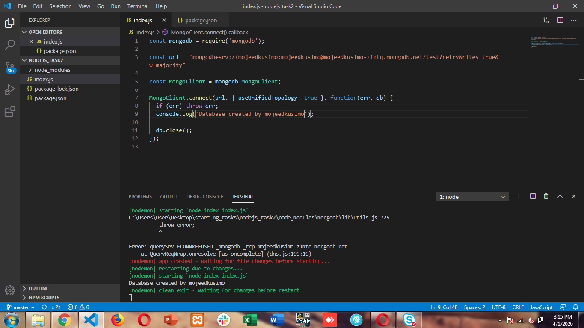

# StartNG Nodejs Task 2

## This is the image of my Database cloud server. I used the mongodb atlas because the current version of mongodb had no support for 32-bit machine. And a previous version which was installed requested for hotfix kb2731284, which was also no longer supported by Microsoft.

#### 

## The following is the image showing the database connection had been established

#### 
